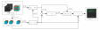
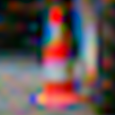
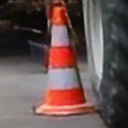
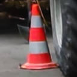
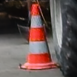
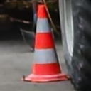
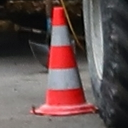
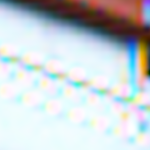
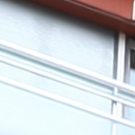
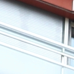

# SBFBurst: Simple Base Frame Guided Residual Network  
  
This is the official implementation of VISAPP 2024 ["Simple Base Frame Guided Residual Network for RAW Burst Image Super-Resolution"](https://www.scitepress.org/PublishedPapers/2024/123483/).  

> **Abstract:** *Burst super-resolution or multi-frame super-resolution (MFSR) has gained significant attention in recent years, particularly in the context of mobile photography. With modern handheld devices consistently increasing their processing power and the ability to capture multiple images even faster, the development of robust MFSR algorithms has become increasingly feasible. Furthermore, in contrast to extensively studied single-image super-resolution (SISR), burst super-resolution mitigates the ill-posed nature of reconstructing high-resolution images from low-resolution ones by merging information from multiple shifted frames. This research introduces a novel and effective deep learning approach, SBFBurst, designed to tackle this challenging problem. Our network takes multiple noisy RAW images as input and generates a denoised, super-resolved RGB image as output. We demonstrate that significant enhancements can be achieved in this problem by incorporating base frame-guided mechanisms through operations such as feature map concatenation and skip connections. Additionally, we highlight the significance of employing mosaicked convolution to enhance alignment, thus enhancing the overall network performance in super-resolution tasks. These relatively simple improvements underscore the competitiveness of our proposed method when compared to other state-of-the-art approaches.* 
  
## Architecture and some results




Below is a table displaying images generated by different methods on Sythetic Dataset:

|                             Base Frame                             |                             DBSR                             |                             MFIR                             |                              BIPNet                              |                           **SBFBurst**                            |                            Ground Truth                            |
|:------------------------------------------------------------------:|:------------------------------------------------------------:|:------------------------------------------------------------:|:----------------------------------------------------------------:|:-----------------------------------------------------------------:|:------------------------------------------------------------------:|
|  |  |  |  |  |  |
|  |  |  |  |  |  |

## Installation and Requirements
  
1. This project was tested in Python 3.11 and CUDA 11.8 environments. It is recommended to set up a virtual environment. All necessary requirements can be installed using pip by running the `bash install.sh` script.
    
2. The data can be downloaded from the creator repository: [Synthetic and BurstSR](https://github.com/goutamgmb/deep-burst-sr). Below are shortcuts to the datasets, but it is important to check if they are still working or updated according to the original authors' pages. Download the datasets and place them in the `_DATASETS/` folder in their respective subfolders:
    
    -   **Synthetic:** [Zurich RAW to RGB Canon set](https://drive.google.com/file/d/12L0LYhG78zQBLkIDyFNE5J6fIH02NUgz/view?usp=drive_link) and [SyntheticBurst validation set](https://drive.google.com/file/d/1DHu3-_tGSc_8Wwwu6sHFaPtmd9ymd0rZ/view?usp=drive_link)
    -   **BurstSR:** [BurstSR dataset (cropped)](https://drive.google.com/drive/folders/1A8FytFrYP-y7pZZhfFxVRzEPwcKl-Cp7?usp=drive_link)
    
3. Update the paths in [local.py](https://chatgpt.com/c/admin/local.py) according to your local environment. The environment settings file [admin/local.py](admin/local.py) contains the paths for pretrained networks, datasets, etc.

  
## Pretrained Model  
  
All the checkpoints including the SpyNet and PWCNet weights are located `pretrained_models/` folder.
  
| Model                               |     PSNR      |  SSIM  | LPIPS  |  
|:------------------------------------|:-------------:|:------:|:------:|  
| SBFBurst Synthetic                  |    42.1918    | 0.9684 | 0.0367 |  
| SBFBurst Real World BurstSR         |    48.8719    | 0.9870 | 0.0224 |
  
## Evaluation  
  
The scripts `run_test_synthetic.py` and `run_test_burstsr.py` are configured to load models from the `pretrained_models/` folder. They will save the predictions in the `workspace/` folder. Ensure you adjust these settings according to meet your requirements.

### Synthetic testing
```python
python run_test_synthetic.py
```  
### Real World BurstSR testing
```python
python run_test_burstsr.py
```
  
## Training  

The training configurations are located in the `train_settings/sbfburst` directory. You can run the training using the following commands:

### Synthetic training
```python
python run_training.py sbfburst default_synthetic
```  
### Real World BurstSR training
```python
python run_training.py sbfburst default_burstsr
```

## Citations


If our code contributes to your research or projects, please consider citing our paper using the following BibTeX reference:

```
@conference{visapp24,  
	author={Anderson Cotrim and Gerson Barbosa and Cid Santos and Helio Pedrini},  
	title={Simple Base Frame Guided Residual Network for RAW Burst Image Super-Resolution},  
	booktitle={Proceedings of the 19th International Joint Conference on Computer Vision, Imaging and Computer Graphics Theory and Applications - Volume 3: VISAPP},  
	year={2024},  
	pages={77-87},  
	publisher={SciTePress},  
	organization={INSTICC},  
	doi={10.5220/0012348300003660},  
	isbn={978-989-758-679-8},  
}
```

## Acknowledgement

The training and testing codes are based on [Deep-Burst-SR](https://github.com/goutamgmb/deep-burst-sr), [BipNet](https://github.com/akshaydudhane16/BIPNet/tree/main) and [BasicVSR_PlusPlus](https://github.com/ckkelvinchan/BasicVSR_PlusPlus).

## Contact  

My email is ander.cotrim@gmail.com. Please feel free to contact me regarding anything related to the paper. I'm also glad to discuss any topic related to Super-Resolution!